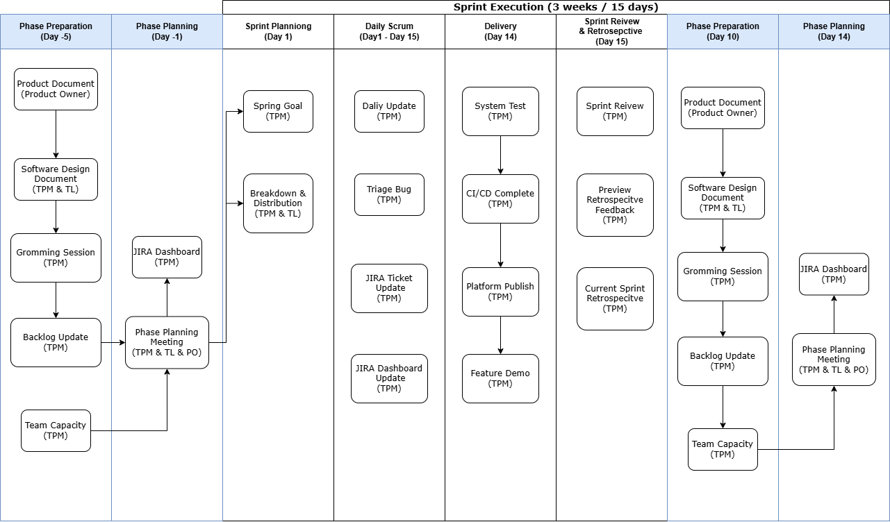
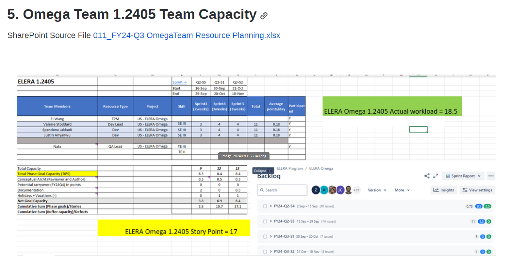
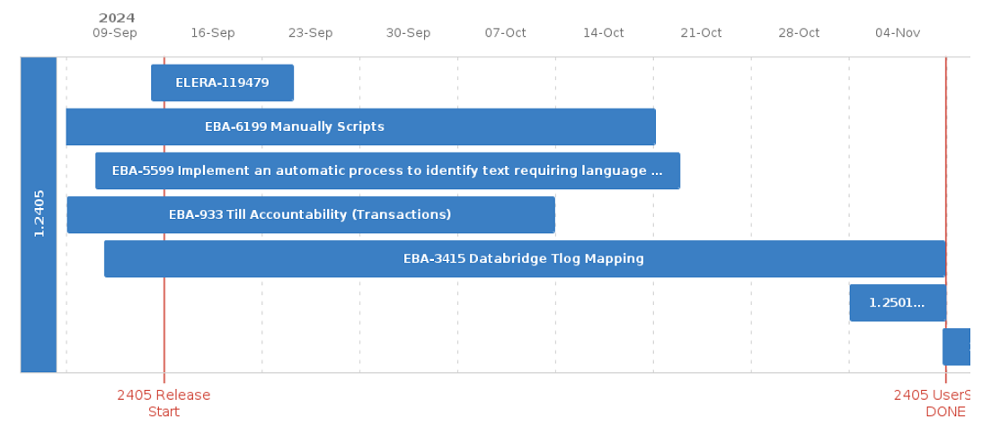
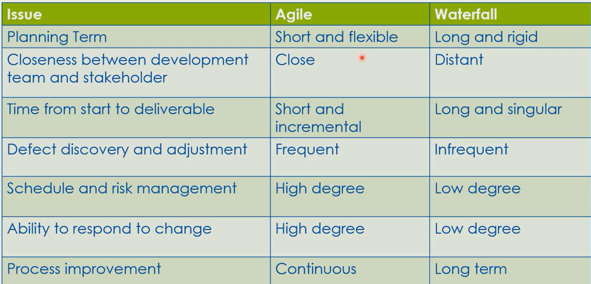

# Table of Contents

- [Table of Contents](#table-of-contents)
- [Agile Workflow](#agile-workflow)
- [Sprint Planning Preparation](#sprint-planning-preparation)
  - [Essential Activities](#essential-activities)
    - [Prepare team capacity and story points calculation](#prepare-team-capacity-and-story-points-calculation)
    - [Prepare Product document and JIRA tickets (Business Requirement Design)](#prepare-product-document-and-jira-tickets-business-requirement-design)
    - [Prepare Software design document (Concept Architecture)](#prepare-software-design-document-concept-architecture)
    - [Story Grooming Session](#story-grooming-session)
  - [Preparation checklist:](#preparation-checklist)
- [Phase Planning](#phase-planning)
  - [Agile Activites](#agile-activites)
    - [Phase Planning Meeting](#phase-planning-meeting)
    - [Technical Project Manager Tasks](#technical-project-manager-tasks)
  - [Exit checklist:](#exit-checklist)
- [Sprint Excecution](#sprint-excecution)
  - [Agile Activites](#agile-activites-1)
    - [Daliy Scrum](#daliy-scrum)
    - [Sprint Plan](#sprint-plan)
    - [Sprint Review](#sprint-review)
  - 
    - [Sprint Retrospective](#sprint-retrospective)
  - [Exit checklist:](#exit-checklist-1)
- [Other Activities](#other-activities)
  - [Product Demo](#product-demo)
  - [Documentations](#documentations)
- [Agile Methods](#agile-methods)
  - [Manifesto for Agile Software Development](#manifesto-for-agile-software-development)
- [Waterfall vs Agile](#waterfall-vs-agile)
- [Reference](#reference)
  - [Template](#template)
      - [Business Requirements Document (BRD) Template](#business-requirements-document-brd-template)
----------------------------------------------------

 
 
 

# Agile Workflow
- This is only a general Agile workflow. It can be modified and adapted to orgranization/project specific needs.
- Each Phase will contain several Sprints. Each Sprint will take 3 weeks or 15 business days.
- Day 1 = First day of Sprint, Day -1 = Last day of Previous Sprint, Day -5 = Five days before Sprint start.
- In each Activity, first lane is the activity name, and name in bracket will be the owner of this activity.
- Phase Preparation and Phase Planning will be loop at the begnning and the end of each Phase (Phase have 3 or 4 Sprints time period)
- TPM = Technical Project Manager, Tech lead = Software team lead, Product Owner = Product team lead

----------------------------------------------------
----------------------------------------------------
 
 
 

# Sprint Planning Preparation
Before a Sprint start, we need to prepare a lot meetings, activity, and documents to ensure smooth Sprint Planning.
A few key exit criteria will be posted at begnning and end of this section, we will post a exit criteria checklist at the end of this section.

## Essential Activities

### Prepare team capacity and story points calculation
- TPM should gather all team member vacation plan for next Sprint period. For example next three months.
- Based on historical team member story points in each Sprint, calculate the individual capacity for each Sprint.
- Normally, we only use 70% story points for Sprint development, and 30% for bug fixing.
- In the 70% story points, we also need to consider the documentation, including development concetp architecture draft, product business requiement design review, and test plan review work load.
> **Exit Criteria[Outputs/TakeAway]:** 
> - Team capacity and story points calculation is done and approved by stakeholders.
> - Upload the team capacity file in cloud for future reference.

------------------------------------------------------------------------

### Prepare Product document and JIRA tickets (Business Requirement Design)
- This is Product team responsibility to preare the Product document (Business Requirement Design) which should be approved by Product and Architecture team. But TPM and Tech lead should review the BRD before software document draft meeting.
- Speicallly care about the Out-of-Scope and Assumptions sections. 
- In this meeting, TPM and Tech lead should have ability to identify the dependencies and risk. 
- JIRA tickets about EPIC level and UserStory level should be created and linked to BRD Confluence page. 
- The relationsship should be EPIC required UserStory. UserStory is required by EPIC.
> **Exit Criteria[Outputs/TakeAway]:** 
> - Business Requirement Design dcoument was approved 
> - software team bring questions about dependencies and risk to softwared document draft (Concept Architecture) meeting to discuss.
> - JIRA tickets created and linked

------------------------------------------------------------------------

### Prepare Software design document (Concept Architecture)
> **Dependency checklist:**
> - Product document (BRD) approved by Product and Architecture team.
> - software team bring questions about dependencies and risk to softwared document draft (Concept Architecture) meeting to discuss.
> - JIRA tickets created and linked
> - Necessary stakeholders have been invited to the meeting and meeting should be recorded.
- Arrange a software design document (Concept Architecture) Gromming meeting with the stakeholders.
  - Software design document (SDD) should have code snipets and examples. A class standard desciption is prefreed. List some key points:
    - security. No matter communiation valid token or access informaiton.
    - REST API Standard
    - Dose the doucment consider every aspect? Database, Scalabitliy, Logging?
  - During the meeting, we should created corresponding development story and waiting for story grooming session for more details
- Arrange a test plan discuss meeting after QA team complete test plan after reviewing previous software design document.
  - create test JIRA tickets and link them to cooresponding dev story.
> **Exit Criteria [Outputs/TakeAway]:** 
> - Software design document (Concept Architecture) approved by stakeholders and architecture team.
> - Test plan document is ready and approved by QA team.
> - Dev story and test test created in JIRA and linked properly to their parents.

------------------------------------------------------------------------

### Story Grooming Session
- During the meeting, we should created corresponding development story and each setup acceptance criteria for each development story.
  - After discussion, set up the story points for each dev story.
    - 0.5 POINTS = few lines change, like pom.xml or single file updates. Estimate time will be 1-2 hours. No more than 4 hours.
    - 1 POINTS = 90% of changes in single service. Ability to have isolated unit test. Estimate time will be one day. No more than two days.
    - 2 POINTS = Changes will happen in 1-3 services, estimate time will be 2-3 days. No more than 1 week.
    - 3 POINTS = Brand new API or feature which need to create new files in a lot of repos. Estimate time will be 3-5 days. No more than 1 week.
    - 5 POINTS = [Should be break down] 
    - 8 POINTS = [Should be break down]
  - Add acceptance critera in each dev story
    - User Story: As a user, I want to reset my password so that I can regain access to my account.
    - Acceptance Crietera: Given I'm on the login page, when I click "Forgot Password", Then I should be redirected to the password reset page.
    - Don't describe how to implement, focus on the what need to happen.
  - Link the dependency between dev story and user story. Use JIRA structure or plan to draft dependency map to stakeholders
> **Exit Criteria [Outputs/TakeAway]:** 
> - Story Sizing completed. Each story point has been estimated with an appropriate number of points reflecing its complexity and effort.
> - Acceptance Critera are well-defined, providing a clar and testable outline.
> - Team members are agrred to add "Groomed" to dev story ticket and that is considered as "READY FOR SPRINT PLANNING"

## Preparation checklist:

- [ ] Development Team capacity and story points calculation which provide by Technical Project Manager
- [ ] JIRA Backlog is priotiezed and all tickets have been created and well-defined.
- [ ] JIRA Backlog have approved Business requirement design document and software design document.
- [ ] Corresponding EPIC, User Story, Dev Story, Test task has been create and set up correctly in JIRA.

------------------------------------------------------------------------

 
 
 

# Phase Planning
Phase Planning was orginzed by Product team to decide which user stories in backlog should be pick up and implement based on the priority and dependencies for next 4 Sprint. 

## Agile Activites

### Phase Planning Meeting
- Product team prioritize the Backlog based on feature business value, complexity, and risk.
- Product team assign backlog UserStory to each team base on team capacity and skill set backgound. For exmaple bank-end, frond-end, and mobile skillset should be distrubited to corresponding team.
- Team memeber should discuss dependencies and risks with the assigned UserStory from backlog as Sprint/Phase Goals.

<Groomed SQL result>

### Technical Project Manager Tasks
- Update JIRA tickets fields to demstrante that this ticket will be commited Phase/Sprint Goal.
- Based JIRA ticket fields to creat Sprint Plan in JIRA Structuere or JIRA Plan.

<JIRA Structure>

<JIRA Plan>

## Exit checklist:

- [ ] All team complete grooming session and team members understand the Sprint Goals and commited them on JIRA field level.
- [ ] JIRA tickest has been updated fields, like Sprint, Start date, Due Date, compnent and etc.
- [ ] Sprint Plan in JIRA Structure or dashbaord is ready to all stakeholders.

----------------------------------------------------
----------------------------------------------------
 
 
 

# Sprint Excecution

## Agile Activites

### Daliy Scrum
- Daliy stand should short and effeciency. 
- Developers and testers update what they did since last Srum and what the problem they are facing.
- The blokers need to addres and have a clean plan and tracking method
- TPM should take responsible to update the JIRA tickets and unblock and tracking the issues we discussed in Scrum.
- TPM also need to update yesterday information to the whol team, including triage bug status, CI/CD progress, what is the major blocker for other team, and protential related global issue anyone menetioned yesterday.

> **Exit Criteria [Outputs/TakeAway]:** 
> - Team members have clear understanding of the Sprint Goal and Phase goal. Everyone has been assigned to correct JIRA ticket
> - From metric reporting level, a update burndown chart should be reported to stakeholders and executive level.
> - All JIRA ticket fields should be updated to current status, including status, due date, dependencies, and comments.

<confluence page>
<burndown chart>

----------------------------------------------------

### Sprint Plan
- Sprint Plan and Sprint Review meeting can be arranged together if the team is small.
- deliver Phase Planning meeting information to all team members
- Before the new Sprint start, either the last day before Spirnt or the first day of the Sprint, the Agile Sprint Planning meeting should be held.
- The Sprint Plan meeting should include the following:
  - Sprint Goal and Phase Goal
  - Team capacity planning and upcoming holiday and vacation plan.
  - Assigning a target point to an individual story point is discoraged; Rather, we are looking for commitments from everyone about what they can deliverd in this Sprint.
- 
> **Exit Criteria [Outputs/TakeAway]:** 
> - Team members have clear understanding of current Sprint Goal and Phase goal. Everyone committed to correct JIRA ticket
> - JIRA Plan or JIRA Structure is updated and shared to all stakeholders
> - 

<Sprint Plan Conflunce Page>

### Sprint Review
- Sprint Plan and Sprint Review meeting can be arranged together if the team is small.
- What we have committed in previous Sprint and we really completed in previous Sprint.
- Are we still on track and on target? If no, what is the mitigation plan and what kind of extra resources we need.
- Generate a Sprint metric reports, including:
  - Burndown chart showing the progress of the Sprint.
  - Story Points Completed rate = (Points of team completed)/(Points of team planned)
  - Feature compelted rate = (Number of features completed)/(Number of features planned)
  - Team Velosity = (Points of team complete in current Sprint)/(Team total logged hours)
  - Bug Density = (Number of bugs found)/(contributted line of code)
> **Exit Criteria [Outputs/TakeAway]:** 
> - Sprint metrics updates
> - Mitigration plan if previous commitement goal was not finished.

<defect filter>
----------------------------------------------------

### Sprint Retrospective
- what we did well
- which part we need to improve
> **Exit Criteria [Outputs/TakeAway]:** 
> - Sprint metrics updates
> - Mitigration plan if previous commitement goal was not finished.

----------------------------------------------------
## Exit checklist:
- [ ] 
- [ ] 
- [ ] 
- [ ] 
----------------------------------------------------
----------------------------------------------------
 
 
 

# Other Activities

## Product Demo
- Product deme can be Sprint Demo or Feature demo.

## Documentations

----------------------------------------------------
----------------------------------------------------
 
 
 

# Agile Methods

## Manifesto for Agile Software Development
- Individuals and interactions over processes and tools
- Working software over comprehensive documentation
- Customer collaboration over contract negotiation
- Responding to change over following a plan

----------------------------------------------------
----------------------------------------------------

 
 
 

# Waterfall vs Agile

# Reference

## Template

#### Business Requirements Document (BRD) Template
******************************************************************************************

**Document Control**  
- **Version**: v1.0  
- **Author**: [Your Name]  
- **Date**: [Creation Date]  
- **Stakeholders**: [List Key Stakeholders]  

---

**1. Executive Summary**  
**Purpose**: A brief explanation of why the project exists and the business problem it will solve.  
**Scope**: Define the boundaries of the project—what will and won’t be included.  
**Objective**: State the high-level objectives the project aims to achieve.

---

**2. Business Background**  
Provide context on the business situation or problem that the project aims to address.  
Include current challenges, goals, or opportunities that the business faces, as well as any relevant business drivers.

---

**3. Scope of Work**  
**In Scope**  
- [List features and deliverables]  
**Out of Scope**  
- [What’s explicitly excluded]  
**Assumptions**  
- [List assumptions]  
**Constraints**  
- [Time, budget, resources]

---

**4. Stakeholder Identification**  
List all key stakeholders (e.g., business units, development teams, end users).  
Clarify roles and responsibilities.

---

**5. Requirements**  
**Business Requirements**: High-level needs and expectations from a strategic perspective.  
**Functional Requirements**:  
- Detailed features, use cases, user stories, and acceptance criteria.  
**Non-Functional Requirements**:  
- Performance, scalability, security, compliance, etc.  
**UI/UX Requirements**:  
- Wireframes, design principles, user flows if applicable.

---

**6. Business Process Flow**  
Use text or diagrams to show how the system fits into current or new workflows.

---

**7. Success Criteria**  
Define how success will be measured (e.g., KPIs, adoption rate, revenue impact).

---

**8. Timeline & Milestones**  
**Project Timeline**: Key phases and stages.  
**Delivery Dates**: Estimated completion dates for major items.

---

**9. Budget & Resources**  
Estimate required resources and costs, including tools, licenses, team size, etc.

---

**10. Risk Management**  
List potential risks with mitigation strategies and contingency plans.

---

**11. Approval and Sign-off**  
Identify approvers and include space for signatures and dates.

******************************************************************************************